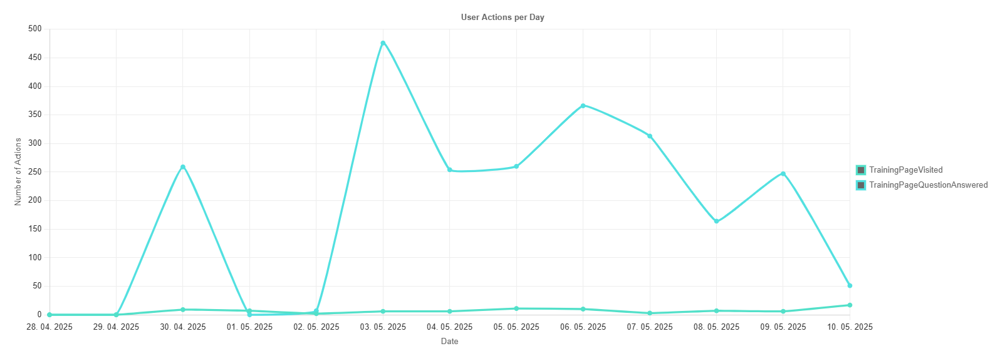

## Traction
Average 300 answered questions per day!

## Visit our demo
https://smartgourd.github.io/PearPacker/

## Demand for student tools confirmed!
This recently launched Czech app was at least according to their Instagram reels able to get 3000 registered students before launch.
And from those around 300 bough the application subscription for 199 Czech crowns per month.
Their main focus is on uploading pdf and making it interactive with chating with it and making flashcards and some questions too.
https://www.instagram.com/studyfi.app/
Its amazing that such a high demand has been confirmed for something very similar and we are working to capture this market too.

## Press release

PRAGUE, March 17, 2025 – Today, at the Faculty of Mathematics and Physics, Charles University, the launch of PearPacker, an innovative platform designed to revolutionize how companies connect with top student talent, was announced. By leveraging cutting-edge AI technologies, PearPacker offers businesses a powerful tool to efficiently identify and engage with ideal candidates, while also providing students with valuable resources to enhance their learning and professional development.

In an age where HR professionals face increasing challenges in targeting and attracting students through traditional means like job fairs and generic listings, PearPacker emerges as a game-changer. By integrating advanced data analysis and generative AI-driven assessments, the platform allows companies to pinpoint the most suitable candidates based on academic performance, project involvement, and skill profiles. This targeted approach significantly reduces recruitment inefficiencies and empowers businesses to build connections with future talent early on.

"Modern data analysis techniques open new opportunities for a more precise and fulfilling transition from school to the workplace, allowing companies to identify young talent while helping students navigate their career paths with ease," said Egor Ulianov, co-founder of PearPacker.

A core feature of PearPacker is its dynamic student engagement strategy, centered around the seamless creation and sharing of high-quality study materials. These tools not only attract a large and diverse student user base but also encourage continuous interaction with the platform—creating a rich database of student achievements that companies can leverage when searching for candidates.

"In the age of LLMs, high-quality exercises to prepare for exams can be generated in seconds. With our platform, students will maximize their benefits from AI and save a tremendous amount of time," added Ladislav Nagy, co-founder.

Unlike conventional job-matching systems, which often rely on superficial data or manual filtering, PearPacker harnesses AI to create detailed candidate profiles, highlighting the skills and accomplishments that matter most to employers. Several tech companies and investors have already expressed interest in supporting the project, recognizing the platform’s potential to redefine how businesses and students connect.

As PearPacker prepares for its official rollout, the team is determined to reshape the recruitment landscape—bridging the gap between academia and industry with innovative, data-driven solutions.

For more information, visit pearpacker.com.

END
